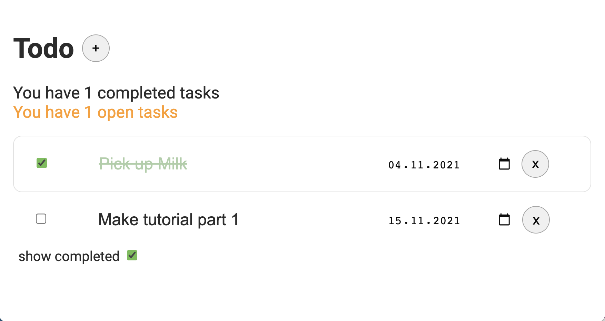

>'situated in front of something else' - Merriam Webster

[](https://twitter.com/JinnForeTec) 

## [Demos Demos Demos Demos Demos](https://jinntec.github.io/Fore)

Sorry for being loud - some people complaining not finding demos.

> ATTENTION: Demos are out of sync with latest release. If you want latest and greatest checkout your local copy please. Demos will be updated
> for final release.

## [Element Reference](https://jinntec.github.io/Fore/doc/reference.html)

For latest and greatest please use a local installation. See 'Running demos and docs'

# What it does

Fore lets you write data-driven front-end applications in a declarative way
just using HTML5 and JavaScript (ES6). 


The use cases range from simple to complex forms to full single page
applications. It can be used standalone or in conjunction with other web 
components or frameworks. 

By using the bare metal of the browser
platform, Fore integrates well with any other library you might want to use in
conjunction with it.


## An xformish framework in Web Components

Fore is a model-driven language that follows the ideas of the XForms 2.0
Standard but applies those to the world of HTML5 Web Components.
 
Going beyond just forms it nicely integrates with Web Components, allowing to configure, 
ochestrate and interact with them by binding their properties to data instances.

Fore uses XML as it's main data model but allows to use JSON alternatively or at the same time. Accessing and mutating JSON data with declarative
actions makes JSON processing even easier than in native JavaScript.

Through the wonderful [fontoXPath library](https://github.com/FontoXML/fontoxpath) Fore is able to process XML in the client with XPath 3.1 and 
XQuery 3.1 support.

Being as close as possible to the web platform standards available in browsers natively, Fore combines well with any other 
JS framework or component library.


## Features

* MVC architecture 
* state engine with dependency tracking
* fully descriptive
* lifecycle with detailed state events
* multiple XML (or JSON) data instances
* group, repeat + switch container components
* generic UI control to bind any kind of component 
* bound template expressions
* powerful XPath/XQuery 3.1 support in the browser
* Submission module declaratively wrapping the fetch API

## Framework-agnostic

Fore focuses on providing a stable processing engine for model-driven
apps. Major premise for a longer-term solution is to stick closely to the features
of the browser platform and avoid specific frameworks for the implementation.

That said it's obvious that Fore does not provide a set of controls
by itself but allows you to use whatever uber-fancy components you have
found elsewhere. May it be some material-design date-picker or 
that nice jquery(sic!) timeline nobody has done better yet. 

That comes to the price of slightly more markup up-front
but allows big flexibility and makes it compatible with any framework
that plays by the rules of the platform.

To use whatever component in Fore you wrap it up in the generic
`fx-control` element.

```
<fx-control ref="boundnode">
    <paper-input class="widget" label="my input" name="foo">
</fx-control>
```

The additional attributes `update-event` and `value-prop` allow to 
customize the wiring of the widget you use. 

```
<fx-control ref="checked" update-event="change" value-prop="checked">
    <paper-checkbox class="widget">paper checkbox</paper-checkbox>
</fx-control>
```

More examples are found in the demos (see running)

## Documentation

Currently the demos are the documentation (see 'demo' folder). All files listed on the demo.html page are expected to work
and serve the purpose of documentation. The intend is to have at least one demo
for each feature and show how to use it with an example.

Some of them also offer some explanations and should give you an idea of building your own.

## Development and Contributions

Default branch of development is 'dev'.
Feature additions or bugfixes will always there.

The master branch is only used for releases. 

Contributions are always welcome.  

### what to contribute

It's not all about code. 

Any feedback is welcome and appreciated. Please use the ['discussions'](https://github.com/Jinntec/Fore/discussions) or
['issues'](https://github.com/Jinntec/Fore/issues) as appropriate to suggest features or ask your questions.

New demo files are highly welcome as always something new can be learned. 
There is a directory called 'template' that contains some blueprints that can be copied to quickly get going.

When working on demos it is recommended to copy your file to the 'demo' folder
and make it work there. If you have additional files you can create
a subdirectory for the new demo.

## Running from CDN

Include the following snippet at end of body:

```
<script type="text/javascript" src="https://cdn.jsdelivr.net/npm/@jinntec/fore@latest/dist/fore-all.js"></script>
```
## Installation

Run

```npm install @jintec/fore```

in your project to install it.

Import it in your HTML page like so:

```
<script type="module">
    import 'node_modules/@jinntec/fore/dist/fore-all.js';
</script>
```

## Developing

If you intend to hack it yourself ...

> you need to have node installed on your machine (using 15.1.0)

* clone this repo to your machine
* run `npm i` to install dependencies

## Running demos and docs

1. checkout this repo or download the sources
1. change to the rootfolder
1. run `npm i` to install dependencies
1. run `npm run start`

starts the testserver with 'doc/index.html' as entry page. This will send you to 'doc/demos.html' as an
entry point. This lists out running examples to learn and copy from.

## Running test suite

`npm run test:watch`
 
Open your browser and goto to the URL mentioned in console output to start Karma and hit the button in the upper right to run the full test-suite. Will
continously rerun the test suite while you're changing code.

Alternatively you can run the test suite from the commandline once:
```
npm run test
```

## Building a package

```npm run build``` creates two bundles in 'dist' directory.

* fore.js - contains just the Fore classes without dependencies and is suitable for creating your own app-specific bundle
* fore-all.js contains everything in one bundle (incl. dependencies) and is the easiest way to use it in your own project with a single module import. 
The package is still huge but is expected to shrink massively.

Include the repective bundle in your webpage with a module import:
```
<script type="module">
    import 'dist/fore-all.js';
</script>
```

## Giant shoulders

The giants that made Fore possible:

* past and current [XForms editors](https://www.w3.org/community/xformsusers/wiki/XForms_2.0) - not all brilliant ideas get traction and fame. Nevertheless a brilliantly worked out state engine.
* [fontoXPath](https://github.com/FontoXML/fontoxpath) - without this wonderful XPath 3.1 implementation in the browser Fore has never been possible - period.
* [depGraph](https://github.com/jriecken/dependency-graph) - finding this gem saved a big bunch of work. 

Thanks to all giants!


