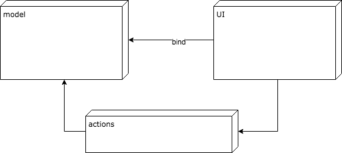

# eXForm - forms for eXist-db

## what's here

This repository serves the development of a new form framework for eXist-db. The actual code is in Java
but the discussion of form markup, milestones and technical details will take place in this repo and its issue tracker.

## Motivation

The motivation to implement a new form framework mostly comes from the need to find a long-term replacement
for betterFORM / XForms. Due to betterFORM being dependent on a specific Saxon version it has become a burden
for maintainence in eXist-db which likes to moves on to newer Saxon versions. Porting the relevant code portions
from one Saxon version to the other is always a huge effort which we want to get rid of.

The idea is to use eXist-db's internal XPath engine to replace Saxon.

## Use cases

There are forms and there are forms - a close look at what is needed avoids mis-orientation
about what is needed. 

That said it's worthwhile pointing out the differences.

### type 1: simple data gathering

Simplest case of form processing is the use case where a few data are gathered for submission
to an endpoint. A large variety of applications just needs that and do not require a lot
of validation, datatyping or other fanciness. 

These type of forms can be done with plain HTML or by using e.g. <iron-form> from Polymer. You
can have simple validations like required, even simple typing etc. and be just fine. The effort
to implement such a form along with some simple validation on the server will not be much
different from using a dedicated form processing facility.

Ideally it should be easy to upgrade to 'exform' when things get more complicated as first perceived.

> amendment: my experiments with forms in Polymer have shown a bit different picture. Actually it can
> get quite complicated quickly. When using custom elements as form components you have to make sure they
> play by the rules by e.g. implementing a validate() function. Furthermore you have to take care of validation
> on the server which quickly gets messy in plain XQuery. As a consequence it can be said that a generic form solution
> gets attractive even earlier. 

### type 2: datatyping and cross-dependencies

While plain HTML can provide simple datatyping it has no facility to handle advanced validation.

By advanced typing here the use of XSD datatypes including custom sub-types is meant. Furthermore there's no facility
to define cross-validation that involves more than the value a control is holding.

While still possible to implement most of this by-hand for a given use case these type of forms will already
profit from a forms framework.

### type 3: XML editing

When it comes to edit even more complex XML documents you are usually confronted with the following requirements:

* you have to juggle with several XML documents for i18n or other files you need to reference 
* you may want some control with regard to datatypes
* you may want to enforce some rules under which you consider your document valid after editing

## exforms - what should it look like?

### birds' eye view

While re-implementing a full XForms implementation is neither sensible nor can be done within a reasonable timeframe and
budget, a broken-down version makes a lot of sense.

The power XForms offers comes from the model and it's descendant elements 'instance', 'bind' and 'submission'. These
elements let XForms stand out from other form solutions. 'exforms' as a new module within eXist-db should preserve
the XForms model functionality but offer it in an HTML5 syntax (instead of XForms namespace).

The XForms UI has been build to abstract clients. It turned out that we rather do not need this as we always deal 
with HTML when it comes to forms and this fully covers our needs. The abstraction caused some of the troubles involved
with form authoring and could be solved much easier by using concrete web components as controls. 

To summarize:

"keep the model but drop the UI"

## Requirements

general:
* MUST provide server-side validation
* SHOULD support offline editing
* SHALL support server push
* MUST be easy to author

for instances:
* MUST provide an implementation of an XForms instance
* MUST support multiple instances (XML documents)
* SHOULD support JSON 
* MAY support CSV

for binds:
* MUST provide an implementation of an XForms bind
* MUST allow binding XML via XPath 2.x or up
* MUST allow for data-typing
* SHOULD allow full XSD datatpyes
* SHOULD support custom XSD types
* SHOULD allow definition of dependencies between data nodes
* MUST support alerts

for submissions:

* MUST provide an implementation of an XForms submission
* SHOULD use XML:DB API to access data
* SHOULD support submission chaining
* MAY support http submissions

## Architecture (draft)

The following graphic shows the main building blocks 'model', 'UI' and 'actions'. These modules together make up
the MVC architecture of XForms.

The model represents the data and it's constraints. The UI binds to the model via the <bind> elements. Actions can be
fired by the UI or the model to change the state of the model which in turn will trigger the UI to update itself.

### distributing the parts

Server-side form processing has proved to be very stable and powerful in the past with betterFORM. It allows 
to validate the data on the server to assure the quality of the data and enforce the rules given by a form. 

That means that the model will be processed on the server which always has the last word when it comes to submissions.
The client however will be implemented as Web Components that reflect the state of nodes in the browser.

[discussion] it's still an open question if the model is represented in the browser at all or in a limited way. E.g. there
are use cases where a user might not want to expose all constraints that are attached to the data. On the other
hand we would like to at least allow limited manipulation of the data in an offline setting. 

### mapping nodes between client and server

One of the central problems with a client-server form solution is the mapping of nodes. Every node in every instance
must have an identity that can be passed to the client for rendering the UI. When the nodes' value is changed by
some user interaction (editing a control) the identity is used to send update the server-side value.

In betterFORM this update mechanism relied on generated ids on the UI controls which very send back and forth to reflect
the state changes. While working this turned out to be a rather complex. When dropping the server-side UI this option
is gone and must be replaced. 

[discussion] Within eXist-db we can use the internal node id or the node number of eXist-db to get an identifier. 
However it must be further investigated how that can work for insertions and deletions of nodes which will trigger
a change of node ids for a given document. 

### using eXist-db XPath and XQuery engine 

The initial reason to develop something like exforms was to replace the XPath engine. This at the same time offers
some interesting potential for a new solution. By using the eXist-db builtin XPath engine we can easily upgrade to 
future enhancements of XPath, use our own ways of supporting custom functions as well as allow full XQuery support in
various places (e.g. calculations and submissions). This certainly offers a whole new level of processing power.

### communication layer

[tbd]

## Migration path

As migrating the whole of XForms model to use the native facilities of eXist-db is a huge effort when considering the
the whole existing functionality we need a migration path that develops from the simple to the more complex cases.

However investigations so far have revealed that we'll use Web Components on the client to represent our UI controls.
To weave binding capabilities into controls we'll use a Mixin or extend controls from a generic <bound-element>
component.

[tbc...]

## porting the XForms model to eXist-db

XForms is a MVC architecture and its power is mainly within the model. This is the part we'd like to be available
when we need stronger capabilities in XML editing. 

XForms also defined a set of UI controls which abstract from the concrete platform. While this is a nice idea
it also tends to complicate thing a lot for the developer. The additional abstraction always forcing thinking 'around the edge'.

In practice we do not have much use for supporting other output than HTML. Therefore a eXist-db form framework
should not deal with porting the original UI controls. Instead we would build upon HTML5 and especially Web Components
to represent the UI part of the forms and bind to XML nodes via <bind> elements. 

## exchanging nodes between client and server

[tbd]

## what is needed

Just a high-level list of things that need to be implemented:

* implement an XPath facade class to evaluate and analyse XPath expressions
* re-implement Instance class to use eXist-dbs' DOM document
* clarify node referencing (nodenumber versus nodeid)
* work out form syntax details
* example forms
* ...

