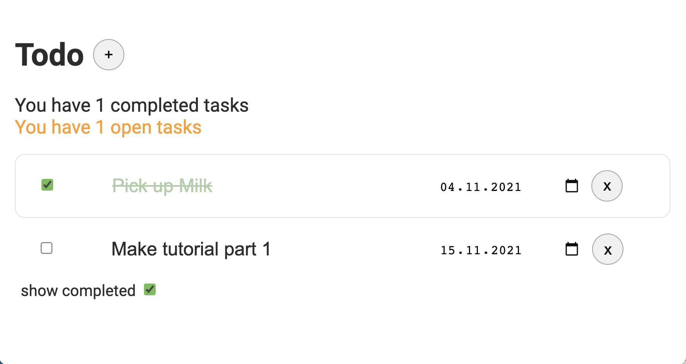

>'situated in front of something else' - Merriam Webster

[Homepage](https://jinntec.github.io/Fore/) |
[Documentation](https://jinntec.github.io/fore-docs/)


# Declarative applications in plain HTML

Fore lets you write data-driven front-end applications in a declarative way
just using HTML5 Web Components. 



[Source code](https://github.com/Jinntec/Fore/blob/960e093fadfbc96eb8514721fb7b53462567f1ec/demo/todo2.html) for above example just uses 53 lines of HTML.

The use cases range from simple to complex forms to full single page
applications. It can be used standalone or in conjunction with other web 
components or frameworks. 

By using the bare metal of the browser
platform, Fore integrates well with any other library you might want to use in
conjunction with it.

## Contents

* [Features](#features)
* [An xformish framework in Web Components](#an-xformish-framework-in-web-components)
* [Framework-agnostic](#framework-agnostic)
* [Development and Contributions](#development-and-contributions)
* [Running from CDN](#running-from-cdn)
* [Installation with npm](#installation-with-npm)
* [Developing](#developing)
* [Running demos and docs](#running-demos-and-docs)
* [Running test suite](#running-test-suite)
* [Linting, formatting and type checking](#linting-formatting-and-type-checking)
* [Running the integration tests](#running-the-integration-tests)
* [Building a package](#building-a-package)
* [Giant shoulders](#giant-shoulders)
* [License](#license)

## Features

**Architecture**

* implemented as vanilla web components in ES6
* no build (tool) required
* MVC architecture
* state engine with dependency tracking for optimized updating
* efficient partial DOM updates

**Data & binding**

* fully descriptive - just HTML5
* binding for structured data like XML, HTML and JSON
* powerful XPath/XQuery 3.1 support in the browser
* descriptive actions for data mutations (setvalue, insert, delete)
* Submission module declaratively wrapping the fetch API

**UI & lifecycle**

* group, repeat, dialog + switch container components
* generic UI control binding any native control or third-party component
* auto-updating Template Expressions
* lifecycle with detailed state events


## An xformish framework in Web Components

Fore is a model-driven language that follows the ideas of the
[XForms 2.0](https://www.w3.org/community/xformsusers/wiki/XForms_2.0) standard but applies
those to the world of HTML5 Web Components. Going beyond just forms it nicely integrates with
Web Components, allowing to configure, orchestrate and interact with them by binding their
properties to data instances.

Fore uses XML as its main data model but allows to use JSON alternatively or at the same time.
Through the wonderful [fontoXPath library](https://github.com/FontoXML/fontoxpath) Fore is able
to process XML in the client with XPath 3.1 and XQuery 3.1 support.


## Framework-agnostic

Fore focuses on providing a stable processing engine for model-driven apps. Major premise for
a longer-term solution is to stick closely to the features of the browser platform and avoid
specific frameworks for the implementation. That said it's obvious that Fore does not provide
a set of controls by itself but allows you to use whatever uber-fancy components you have found
elsewhere. May it be some material-design date-picker or that nice jquery(sic!) timeline nobody
has done better yet.

That comes to the price of slightly more markup up-front but allows big flexibility and makes
it compatible with any framework that plays by the rules of the platform.

To use whatever component in Fore you wrap it up in the generic
`fx-control` element.

```
<fx-control ref="boundnode">
    <paper-input class="widget" label="my input" name="foo">
</fx-control>
```

The additional attributes `update-event` and `value-prop` allow to 
customize the wiring of the widget you use. 

```
<fx-control ref="checked" update-event="change" value-prop="checked">
    <paper-checkbox class="widget">paper checkbox</paper-checkbox>
</fx-control>
```

More examples are found in the [`demo`](./demo) folder, or interactively in [Running demos and docs](#running-demos-and-docs) below.


## Development and Contributions

`dev` is the default branch and where feature additions and bugfixes land.
`master` is only used for releases.

Contributions are always welcome — see [contributing.md](./contributing.md) for what to
contribute (code, demos, docs) and how, and [CODE_OF_CONDUCT.md](./CODE_OF_CONDUCT.md) for
community guidelines.

Any feedback is welcome and appreciated. Please use the
['discussions'](https://github.com/Jinntec/Fore/discussions) or
['issues'](https://github.com/Jinntec/Fore/issues) as appropriate to suggest features or ask
your questions.

## Running from CDN

Include the following snippet at end of body:

```html
<script type="module" src="https://cdn.jsdelivr.net/npm/@jinntec/fore@latest/dist/fore.js"></script>
```

## Installation with npm

Run `npm install @jinntec/fore` in your project to install it.

If you're using a bundler (Vite, webpack, Rollup, ...), import it normally:

```js
import '@jinntec/fore';
```

If you're serving plain HTML without a bundler, reference the built bundle directly by its
path inside `node_modules` (or copy `dist/fore.js` alongside your page):

```html
<script type="module" src="node_modules/@jinntec/fore/dist/fore.js"></script>
```

## Developing

If you intend to hack it yourself ...

> you need to have node installed on your machine (>= 16.19.1, see `engines` in `package.json`)

* clone this repo to your machine
* run `npm i` to install dependencies

## Running demos and docs

1. checkout this repo or download the sources
1. change to the rootfolder and execute following command in your shell
1. `npm install` to install Fore dependencies
1. `npm run install-demos` to install Demo dependencies
1. `npm run start` starts the testserver with 'doc/index.html' as entry page. This will send you to 'doc/demos.html' as an
entry point. This lists out running examples to learn and copy from.

## Running test suite

`npm run test:watch`
 
Open your browser and goto to the URL mentioned in console output to start Karma and hit the button in the upper right to run the full test-suite. Will
continously rerun the test suite while you're changing code.

Alternatively you can run the test suite from the commandline once:
```
npm run test
```

## Linting, formatting and type checking

```bash
npm run lint         # ESLint + Prettier check
npm run format       # Auto-fix ESLint + Prettier
npm run lint:types   # TypeScript type checking via JSDoc
```

## Running the integration tests

Integration tests use Cypress and require the demo server (see [Running demos and
docs](#running-demos-and-docs)) to be running first:

```
npm run start
```

Then, in another terminal, either open the interactive Cypress UI and choose your browser:

```
npx cypress open
```

or run the tests headlessly:

```
npx cypress run
```


## Building a package

`npm run build` creates two bundles in the `dist/` directory using Vite + esbuild:

* `fore.js` — production bundle: minified, console output stripped, no devtools
* `fore-dev.js` — development bundle: minified but retains console output and includes the Fore devtools panel

Include the bundle in your webpage with a module import:
```html
<script type="module" src="dist/fore.js"></script>
```

## Giant shoulders

The giants that made Fore possible:

* past and current [XForms editors](https://www.w3.org/community/xformsusers/wiki/XForms_2.0) - not all brilliant ideas get traction and fame. Nevertheless a brilliantly worked out state engine.
* [fontoXPath](https://github.com/FontoXML/fontoxpath) - without this wonderful XPath 3.1 implementation in the browser Fore has never been possible - period.
* [depGraph](https://github.com/jriecken/dependency-graph) - finding this gem saved a big bunch of work. 

Thanks to all giants!

## License

MIT — see [LICENSE](./LICENSE).


