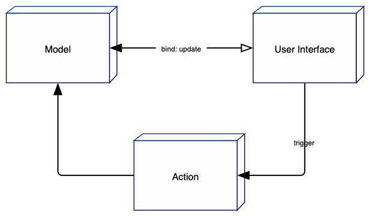

*** todo: needs update ***

# Architecture

Fore is built specifically for eXist-db to ease quick development of powerful form applications. One central requirement
here is server-side validation. Fore also wants to make maximum use of eXist-db's immanent power as a XML database. To 
enable that a server-side approach to form processing is necessary. 

With the increasing power of browsers Fore however wants to go beyond pure server-side logic with a dump client. The 
final goal is to follow the 'half-object pattern' that distributes the logic between client and server thereby 
allowing applications to work offline. Developing Fore will follow an incremental approach that emphasizes on 
the server-side as a start and move more and more logic to the client gradually.

This architecture has been proven during many years of betterFORM use. A pure client-side approach always lacks
the security of a double validation and suffers from this insufficiency in production. Additional mechanisms
need to be used on the server to assert the correctness of the data which degrades productivity. Additionally the 
form needs to disclose all business-rules used for validation to the client.  

## XForms and Fore

The XForms architecture has been designed by clever people more than a decade ago. It has been battle-tested in
extremely complex scenarios and there's hardly any other form framework in the world that can compete. However
it also employs some complexity and learning-curve that is not easy to master for everyone. 

Fore will keep close to the overall architecture and even try to keep element names and attributes whereever 
it makes sense. We hope to thereby make it easier for XForms users to do the migration to Fore.

## The XForms MVC

The following graphic shows the main building blocks 'model', 'UI' and 'actions'. These modules together make up
the MVC architecture of XForms.




The model represents the data and it's constraints. The UI binds to the model via the `<xf-bind> elements. Actions can be
fired by the UI or the model to change the state of the model which in turn will trigger the UI to update itself.


### client- and server data model

To allow full offline-capabilities Fore has to pass the relevant data to the client and allow
it to manipulate the data by itself. 

The primary goal of the new forms solution is to edit XML data. However browser do not well with XML
natively. Furthermore JSON has made the race in the client-side world and the use of XML and XPath
has always had a nice-existence at best. This is not going to change.

XPath (and XQuery) are the powertools of XML but they are not (really) present in the browser. To circumvent
these problems and give each side what it deserves we need to introduce some mapping.

On the server we deal with data instances which represent XML documents. On the client we'd like to 
consume some JSON data to render and update our UI. A plain XML to JSON conversion is possible but still leaves
us with the problem of resolving path expressions and map those from XPath to e.g. JSONPath. This involves some
complexity and potential for errors.

A simpler mechanism would be to use the `bind` elements as intermediates:

a `bind` references one or more nodes by an XPath expression and on the other
hand allow a UI control to bind to it via id. 

e.g. 
```
<bind id="foo" ref="//aNode">

...

<input bind="foo">
```

Besides the value the bind also has access to the different facets of validation, error-messages etc.
By serializing the state of a bind we can feed the UI with the necessary bits. 

A JSON representation of a bind would look like this:
```
{
    "bind":"salary",
    "readonly":false,
    "required":true,
    "value":110,
    "datatype":"xs:string",
    "valid":true,
    "relevant":true
}
```

## Q & A

### why use Custom Elements for the model?

As has been pointed out the model is executed on the server. So why use Custom Element syntax for
these though they never get to the client for being enhanced as Web Components?

Here are the arguments:

* first, it would be rather confusing to use two different markups for a single purpose e.g.
XML for the model part and Custom Elements for the client. In practice you often keep a complete
form (the model and the UI) in one HTML document. It is rather convenient to have all in one place.
* further it might well happen that the model elements get an representation in the browser for 
debugging purposes.
* it might even happen that the client gets a simplified version of the model which will get synced
back later in time.


